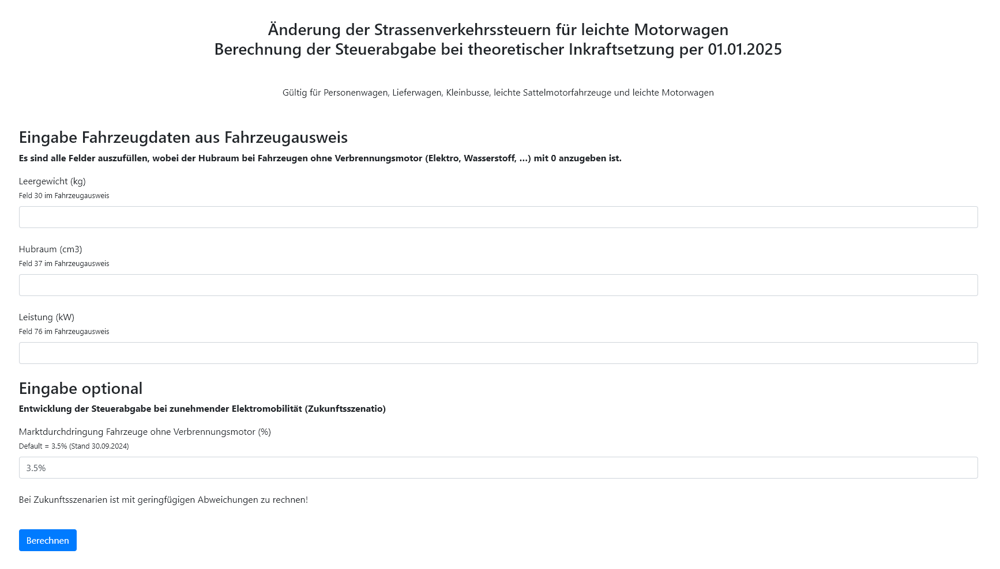

# Verantwortlich
[](https://teams.microsoft.com/l/chat/0/0?users=fabio.tavernini@itsh.ch) [](https://teams.microsoft.com/l/chat/0/0?users=lucas.koeppli@itsh.ch)


# Strassenverkehrssteuer - Rechner :racing_car:
Ein Web-Rechner für die Strassenverkehrssteuer im Kanton Schaffhausen - [https://sh.ch/fileadmin/Redaktoren/STVA/steuerrechner/](https://sh.ch/fileadmin/Redaktoren/STVA/steuerrechner/)



#  Funktion
Der Steuerrechner führt alle Berechnungen zur Steuer auf Client-Seite (über Javascript) aus! - kein Backend o.ä
>[!NOTE]
>Serverseiteiger Code wird nicht benötigt, da die Berechnungsgrundlagen öffentlich dargelegt werden müssen.

## Aufbau JS

### Funktion calculatetaxneu
``` JS
function calculatetaxneu(leergewicht, hubraum, leistung, marktdurchdringung) {

    // Berechnungsmatrix
    const matrix = [
        { Anteil: 0, FaktorX: 0.00000, FaktorY: 0.13010, FaktorZ: 0.00000 },
        { Anteil: 3.5, FaktorX: 0.00276, FaktorY: 0.13010, FaktorZ: 0.03636 },
        { Anteil: 10, FaktorX: 0.00772, FaktorY: 0.13010, FaktorZ: 0.09898 },
        { Anteil: 20, FaktorX: 0.01515, FaktorY: 0.13010, FaktorZ: 0.18641 },
        { Anteil: 30, FaktorX: 0.02227, FaktorY: 0.13010, FaktorZ: 0.26419 },
        { Anteil: 40, FaktorX: 0.02914, FaktorY: 0.13010, FaktorZ: 0.33383 },
        { Anteil: 50, FaktorX: 0.03575, FaktorY: 0.13010, FaktorZ: 0.39411 },
        { Anteil: 60, FaktorX: 0.04212, FaktorY: 0.13010, FaktorZ: 0.45067 },
        { Anteil: 70, FaktorX: 0.04826, FaktorY: 0.13010, FaktorZ: 0.50215 },
        { Anteil: 80, FaktorX: 0.05416, FaktorY: 0.13010, FaktorZ: 0.54921 },
        { Anteil: 90, FaktorX: 0.05989, FaktorY: 0.13010, FaktorZ: 0.59238 },
        { Anteil: 100, FaktorX: 0.06541, FaktorY: 0.13010, FaktorZ: 0.63212 }
    ];

    // Eintrag finden in der Matrix mit eingegebener Marktdurchdringung
    let row = matrix.find(entry => entry.Anteil === marktdurchdringung);

    // Falls kein Wert gefunden
    if (!row) {
        return "Fehler: Invalider Eintrag";
    }

    // Faktoren auslesen 
    const { FaktorX, FaktorY, FaktorZ } = row;

    // Steuer berechnen
    const tax = (leergewicht * FaktorX) + (hubraum * FaktorY) + (leistung * FaktorZ);

    // Berechnete Steuer retournieren
    return Math.round(tax);

}

```


### Funktion calculatetaxbisher
``` js

function calculatetaxbisher(leergewicht, hubraum, leistung) {

    if (!leergewicht || !leistung) {
        return "";
    }

    // Alte Formel zur Steuerberechnung
    if (hubraum == 0) {
        
        if (leistung > 30) {
            // Perform the calculation if leistung is greater than 30
            let result = Math.ceil((leistung - 30) / 5) * 3 + 120;
            return result;
        } else {
            // Return 120 if leistung is 30 or less
            return 120;
        }

    } else {
        
        if (hubraum > 800) {
            tax = ((Math.ceil((hubraum - 800) / 100) * 12) + 120);
        } else {
            tax = 120;
        }

    }

    // Rückgabe des Wertes alte Steuer
    return Math.round(tax);
}

```

Die beiden Funktionen werden vom Button ``` <button class="mt-4 btn btn-primary text-right-custom" onclick="berechnen()">Berechnen</button> ``` angestossen:

``` js
        function berechnen() {

            let leergewicht = document.getElementById('leergewicht');
            let hubraum = document.getElementById('hubraum');
            let leistung = document.getElementById('leistung');
            let marktdurchdringung = document.getElementById('marktdurchdringung');

            if (leergewicht.reportValidity() && hubraum.reportValidity() && leistung.reportValidity() && marktdurchdringung.reportValidity()) {

                taxneu = calculatetaxneu(parseFloat(leergewicht.value), parseFloat(hubraum.value), parseFloat(leistung.value), parseFloat(marktdurchdringung.value));
                taxbisher = calculatetaxbisher(parseFloat(leergewicht.value), parseFloat(hubraum.value), parseFloat(leistung.value));

                document.getElementById('steuerneu').value = taxneu;
                document.getElementById('steuerbisher').value = taxbisher;

            }

        }


```
So werden die Felder "steuerneu" und "steuerbisher" befüllt.

## Styling :paintbrush:
Styling wird grösstenteils mit Bootstrap geregelt.
Eingebunden sind folgende JS & Css Files:

<ul>
<li>

```HTML
<link href="https://cdn.jsdelivr.net/npm/bootstrap@5.3.3/dist/css/bootstrap.min.css" rel="stylesheet"
    integrity="sha384-QWTKZyjpPEjISv5WaRU9OFeRpok6YctnYmDr5pNlyT2bRjXh0JMhjY6hW+ALEwIH" crossorigin="anonymous">
```

</li>
<li>

```HTML
<script src="https://cdn.jsdelivr.net/npm/bootstrap@5.3.3/dist/js/bootstrap.bundle.min.js"
    integrity="sha384-YvpcrYf0tY3lHB60NNkmXc5s9fDVZLESaAA55NDzOxhy9GkcIdslK1eN7N6jIeHz"
    crossorigin="anonymous"></script>
```
</li>
<li>

```HTML
<link rel="stylesheet" href="https://cdn.jsdelivr.net/npm/bootstrap@4.0.0/dist/css/bootstrap.min.css"
    integrity="sha384-Gn5384xqQ1aoWXA+058RXPxPg6fy4IWvTNh0E263XmFcJlSAwiGgFAW/dAiS6JXm" crossorigin="anonymous">
```
</li>
<li>

```HTML
<script src="https://code.jquery.com/jquery-3.2.1.slim.min.js"
    integrity="sha384-KJ3o2DKtIkvYIK3UENzmM7KCkRr/rE9/Qpg6aAZGJwFDMVNA/GpGFF93hXpG5KkN"
    crossorigin="anonymous"></script>
```
</li>
<li>

```HTML
<script src="https://cdn.jsdelivr.net/npm/popper.js@1.12.9/dist/umd/popper.min.js"
    integrity="sha384-ApNbgh9B+Y1QKtv3Rn7W3mgPxhU9K/ScQsAP7hUibX39j7fakFPskvXusvfa0b4Q"
    crossorigin="anonymous"></script>
```
</li>
<li>

```HTML
<script src="https://cdn.jsdelivr.net/npm/bootstrap@4.0.0/dist/js/bootstrap.min.js"
    integrity="sha384-JZR6Spejh4U02d8jOt6vLEHfe/JQGiRRSQQxSfFWpi1MquVdAyjUar5+76PVCmYl"
    crossorigin="anonymous"></script> 
```
</li>
</ul>

### styles.css :ribbon: 

Wenige attribute werden manuell mit der Datei [style.css](style.css) gesteuert:

```css
body,html{
    width: 100vw;
    overflow-x: hidden;
}

#shlogo {

    position: absolute;
    right: 0px;
    height: 100px;

}

#navbar {
    
    height: 100px;
    background: rgb(2, 0, 36);
    background: linear-gradient(0deg, rgba(29,29,27,255) 33%, rgba(255,220,0,255) 20%);

}

```

## Browser Support :desktop_computer: 
Mit folgenden Browsern wurde bereits getestet:

- Opera (latest, Desktop)
- Firefox (latest, mobile, Samsung Galaxy S22 Ultra)
- Ungoogled chromium (latest, Desktop)

## Kontakt & Support :email:
### Strassenverkehrsamt Schaffhausen
- [Markus Storrer](mailto:markus.storrer@sh.ch)

### Informatik Schaffhausen
- [Fabio Tavernini](mailto:Fabio.Tavernini@itsh.ch)
- [Lucas Köppli](mailto:Lucas.Koeppli@itsh.ch)